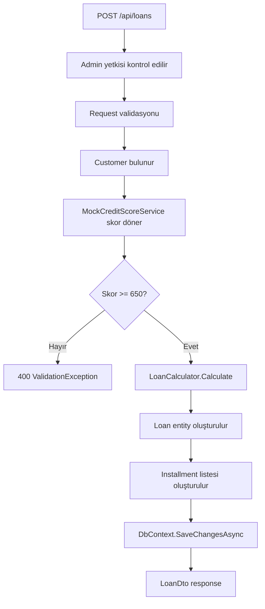
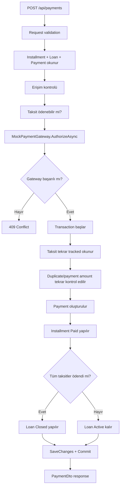
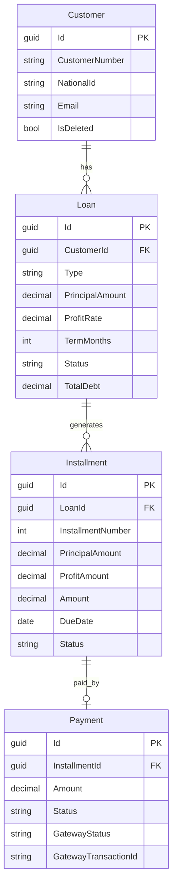

# Nomisma Proje İncelemesi

Bu doküman, **Digital Loan and Repayment Management System** case çalışması için Nomisma reposunun teknik ve işlevsel incelemesidir. İnceleme gerçek dosya yapısına, class isimlerine, endpointlere, EF Core konfigürasyonlarına, frontend akışına ve testlere göre hazırlanmıştır.

---

# 1. Project Overview

Nomisma, bireysel müşterilerin kredi başvurularını, oluşan taksit planlarını ve taksit ödemelerini dijital ortamda yönetmek için geliştirilmiş full-stack bir bankacılık case-study uygulamasıdır.

Ana iş hedefi:

- Banka operasyon kullanıcısının müşteri oluşturabilmesi.
- Müşteri adına kredi açabilmesi.
- Kredi açıldığında otomatik taksit planı üretilebilmesi.
- Müşterinin kendi kredilerini ve taksitlerini görebilmesi.
- Taksit ödemesinin mock ödeme sistemi üzerinden alınabilmesi.
- Ödeme sonrası taksit ve kredi durumunun güncellenebilmesi.
- Müşteri bazlı borç/özet bilgisinin hesaplanabilmesi.

Ana kullanıcı akışı:

1. Admin kullanıcı sisteme giriş yapar.
2. Yeni müşteri oluşturur.
3. Müşteri için kredi oluşturur.
4. Backend, müşterinin mock kredi skorunu kontrol eder.
5. Kredi uygun bulunursa toplam borç ve taksit planı hesaplanır.
6. Taksitler otomatik olarak krediye bağlı şekilde oluşturulur.
7. Müşteri kendi panelinden taksitleri görür.
8. Müşteri ödeme yapar.
9. Ödeme başarılıysa taksit `Paid` olur.
10. Tüm taksitler ödendiğinde kredi `Closed` olur.
11. Müşteri özeti kalan borç, kalan ana para ve gecikmiş taksit sayısını gösterir.

---

# 2. Technology Stack

| Teknoloji | Kullanım | Açıklama |
|---|---|---|
| .NET 8 | Backend Web API | `src/Nomisma.Api/Nomisma.Api.csproj` hedef framework `net8.0`. REST API, JWT auth, middleware ve Swagger burada. |
| ASP.NET Core Web API | API layer | Controller tabanlı endpointler `src/Nomisma.Api/Controllers` altında. |
| EF Core 8 | ORM / database access | Application servisleri `INomismaDbContext` üzerinden EF Core `DbSet` kullanıyor. |
| SQL Server | Veritabanı | `UseSqlServer` ile `NomismaDb` connection string kullanılıyor. |
| ASP.NET Core Identity | Kullanıcı/rol yönetimi | `ApplicationUser`, `UserManager`, `RoleManager`, `IdentityDbContext` kullanılmış. |
| JWT Bearer Auth | Kimlik doğrulama | `JwtTokenService`, `CurrentUserService`, `AuthController` ile token üretimi ve rol bazlı erişim var. |
| Swashbuckle.AspNetCore | Swagger | Development ortamında Swagger UI açılıyor. |
| React 19 | Frontend UI | `client/src/App.tsx` içinde admin ve müşteri panelleri var. |
| Vite 6 | Frontend build/dev server | `client/package.json` scriptleri `vite`, `vite build`, `vite preview`. |
| TypeScript 5.7 | Frontend type safety | API tipleri `client/src/api.ts` içinde tanımlı. |
| React Router DOM | Client routing | `/login`, `/admin`, `/customer` route yapısı var. |
| lucide-react | Icon set | `Landmark`, `CreditCard`, `RefreshCw`, `Trash2` gibi ikonlar kullanılıyor. |
| CSS | Styling | Tailwind kurulumu yok; stil `client/src/index.css` ve `client/src/App.css` içinde custom CSS ile yapılmış. |
| Fetch API | HTTP client | Axios kullanılmıyor; `client/src/api.ts` içinde `fetch` tabanlı `apiRequest` wrapper var. |
| xUnit | Backend testleri | `tests/Nomisma.Tests` altında domain, payment, mock integration ve JWT testleri var. |
| EF Core InMemory | Test database | `PaymentServiceTests` içinde in-memory database kullanılıyor. |

Beklenen teknolojilerle karşılaştırma:

- `Axios`: Repoda yok. Frontend API çağrıları native `fetch` ile yapılmış.
- `Tailwind CSS`: Repoda Tailwind config veya package yok. Custom CSS kullanılmış.
- `SQL Server + EF Core`: Var.
- `React + Vite + TypeScript`: Var.

---

# 3. Solution / Folder Structure

Repo ana yapısı:

```text
Nomisma/
  src/
    Nomisma.Api/
    Nomisma.Application/
    Nomisma.Domain/
    Nomisma.Infrastructure/
  tests/
    Nomisma.Tests/
  client/
  README.md
  Nomisma.sln
```

Backend yapısı:

| Klasör | Sorumluluk |
|---|---|
| `src/Nomisma.Api` | ASP.NET Core host, controllerlar, middleware, auth request/response entry pointleri. |
| `src/Nomisma.Api/Controllers` | REST endpointleri: `AuthController`, `CustomersController`, `LoansController`, `InstallmentsController`, `PaymentsController`. |
| `src/Nomisma.Api/Middleware` | Global exception handling: `ExceptionHandlingMiddleware`. |
| `src/Nomisma.Api/Services` | HTTP context üzerinden aktif kullanıcı bilgisi: `CurrentUserService`. |
| `src/Nomisma.Application` | Use-case servisleri, DTO/request modelleri, abstraction interface'leri, application exception sınıfları. |
| `src/Nomisma.Application/Customers` | `CustomerService`, customer DTO ve request modelleri. |
| `src/Nomisma.Application/Loans` | `LoanService`, loan DTO ve request modelleri. |
| `src/Nomisma.Application/Installments` | `InstallmentService`, installment DTO ve update request. |
| `src/Nomisma.Application/Payments` | `PaymentService`, payment DTO ve create request. |
| `src/Nomisma.Application/Abstractions` | Persistence, auth ve external integration interface'leri. |
| `src/Nomisma.Domain` | Entity, enum ve domain loan calculator. |
| `src/Nomisma.Domain/Entities` | `Customer`, `Loan`, `Installment`, `Payment`. |
| `src/Nomisma.Domain/Loans` | `LoanCalculator`, `LoanCalculationResult`, `InstallmentScheduleItem`. |
| `src/Nomisma.Infrastructure` | EF Core, SQL Server, Identity, JWT implementation, mock integrations. |
| `src/Nomisma.Infrastructure/Persistence` | `NomismaDbContext`, migrations, seeder, transaction manager. |
| `src/Nomisma.Infrastructure/Persistence/Configurations` | EF Core entity configuration dosyaları. |
| `src/Nomisma.Infrastructure/Integrations` | `MockCreditScoreService`, `MockPaymentGateway`. |
| `src/Nomisma.Infrastructure/Identity` | `ApplicationUser`, `UserAccountService`. |

Frontend yapısı:

| Klasör/Dosya | Sorumluluk |
|---|---|
| `client/src/App.tsx` | Login, admin dashboard, customer dashboard ve UI bileşenlerinin büyük kısmı. |
| `client/src/api.ts` | API base URL, TypeScript DTO tipleri, fetch wrapper ve API fonksiyonları. |
| `client/src/main.tsx` | React root ve `BrowserRouter`. |
| `client/src/App.css` | Panel, tablo, form, status badge ve responsive layout CSS'i. |
| `client/src/index.css` | Global CSS değişkenleri ve temel element stilleri. |
| `client/public` | Favicon ve icon assetleri. |

Yapı değerlendirmesi:

- Backend temiz şekilde 4 projeye ayrılmış: API, Application, Domain, Infrastructure.
- Bu yapı Clean Architecture'a yakındır.
- Ancak Application layer doğrudan EF Core `DbSet` ve `Include` kullanıyor. Bu pratik bir case-study yaklaşımıdır, fakat katı Clean Architecture'da repository/specification veya query abstraction daha izole olurdu.
- Frontend tek büyük `App.tsx` dosyasında toplanmış. Küçük case için anlaşılır, fakat büyürse `pages`, `components`, `hooks`, `api`, `types` klasörlerine bölünmeli.
- `client/README.md` Vite template içeriği olarak kalmış; proje özel frontend dokümantasyonu değil.

---

# 4. Backend Architecture

Backend organizasyonu:

- API layer: `Nomisma.Api`
- Application layer: `Nomisma.Application`
- Domain layer: `Nomisma.Domain`
- Infrastructure layer: `Nomisma.Infrastructure`

Controllerlar:

- `CustomersController`: müşteri listeleme, oluşturma, güncelleme, silme, özet endpointleri.
- `LoansController`: kredi listeleme, detay, oluşturma, durum güncelleme, krediye bağlı taksitleri listeleme.
- `InstallmentsController`: taksit detay ve admin taksit güncelleme.
- `PaymentsController`: ödeme listeleme, detay, ödeme oluşturma.
- `AuthController`: login ve JWT üretimi.

Servisler:

- `CustomerService`: müşteri CRUD, soft delete, müşteri özeti, overdue taksit işaretleme.
- `LoanService`: kredi oluşturma, kredi hesaplama, taksit üretimi, kredi listeleme/detay.
- `InstallmentService`: taksit detay ve admin update.
- `PaymentService`: payment gateway çağrısı, payment kaydı, installment status update, loan close.

DTO / Entity separation:

- Entity'ler `Nomisma.Domain.Entities` altında.
- Request/DTO modelleri application klasörlerinde.
- Controllerlar entity dönmüyor; `CustomerDto`, `LoanDto`, `InstallmentDto`, `PaymentDto` dönüyor.

DbContext:

- `NomismaDbContext`, `IdentityDbContext<ApplicationUser, IdentityRole<Guid>, Guid>` sınıfından türemiş.
- Hem domain tabloları hem Identity tabloları aynı database context içinde.
- `ApplyConfigurationsFromAssembly` ile entity configuration sınıfları yükleniyor.

Dependency Injection:

- `Program.cs` içinde `AddApplication()` ve `AddInfrastructure()` çağrılıyor.
- Application servisleri scoped kayıtlı.
- Infrastructure tarafında `INomismaDbContext`, `ITransactionManager`, `ICreditScoreService`, `IPaymentGateway`, `IUserAccountService`, `IJwtTokenService` kayıtlı.

Validation:

- FluentValidation yok.
- Validasyonlar servis metotları içinde manuel yapılıyor.
- Örnekler:
  - `CustomerService.ValidateCreate`
  - `LoanService.ValidateCreate`
  - `PaymentService.ValidateRequest`
  - `PaymentService.EnsureInstallmentPayable`

Exception handling:

- `ExceptionHandlingMiddleware` application exception türlerini HTTP status code'a çeviriyor.
- `ValidationException` -> 400
- `NotFoundException` -> 404
- `ConflictException` -> 409
- `ForbiddenException` -> 403
- Diğerleri -> 500
- Response formatı basit: `{ "message": "..." }`

External/mock services:

- `ICreditScoreService` -> `MockCreditScoreService`
- `IPaymentGateway` -> `MockPaymentGateway`

Database access flow:

```text
Controller -> Application Service -> INomismaDbContext -> NomismaDbContext -> SQL Server
```

Mimari değerlendirme:

- Proje **Clean Architecture'a yakın layered architecture** olarak değerlendirilebilir.
- Domain, Application, Infrastructure ve API ayrımı olumlu.
- Application katmanı EF Core'a kısmen bağımlı olduğu için "strict Clean Architecture" değil, "pragmatic Clean Architecture / layered Web API" demek daha doğru olur.

---

# 5. Domain Model

## Customer

Dosya: `src/Nomisma.Domain/Entities/Customer.cs`

Müşteriyi temsil eder.

Önemli alanlar:

- `Id`: Guid primary key.
- `CustomerNumber`: müşteri numarası, örn. `CUST-1001`.
- `FirstName`, `LastName`, `FullName`: müşteri adı.
- `NationalId`: kimlik numarası.
- `Email`: iletişim ve login email'i.
- `PhoneNumber`, `Address`, `DateOfBirth`: müşteri bilgileri.
- `IsDeleted`: soft delete flag'i.
- `CreatedAtUtc`, `UpdatedAtUtc`: audit alanları.
- `Loans`: müşterinin kredi koleksiyonu.

İş anlamı:

- Bir müşteri birden fazla krediye sahip olabilir.
- Müşteri silme fiziksel delete değil, soft delete olarak tasarlanmış.

## Loan

Dosya: `src/Nomisma.Domain/Entities/Loan.cs`

Müşteriye verilen krediyi temsil eder.

Önemli alanlar:

- `CustomerId`: kredi sahibi müşteri.
- `Type`: `Personal`, `Education`, `Vehicle`.
- `PrincipalAmount`: ana para.
- `ProfitRate`: kar oranı.
- `TermMonths`: vade ay sayısı.
- `StartDate`: kredi başlangıç tarihi.
- `Status`: `Active` veya `Closed`.
- `CreditScore`: kredi oluşturma anında alınan skor.
- `TotalProfit`: toplam kar.
- `TotalDebt`: toplam geri ödeme.
- `CreatedAtUtc`, `ClosedAtUtc`: zaman bilgileri.
- `Installments`: krediye bağlı taksitler.

İş anlamı:

- Kredi açıldığında hesaplanan finansal değerler kredi üzerinde saklanır.
- Tüm taksitler ödenince kredi kapatılır.

## Installment

Dosya: `src/Nomisma.Domain/Entities/Installment.cs`

Kredi geri ödeme planındaki tek bir taksiti temsil eder.

Önemli alanlar:

- `LoanId`: bağlı olduğu kredi.
- `InstallmentNumber`: sıra numarası.
- `PrincipalAmount`: o taksite düşen ana para.
- `ProfitAmount`: o taksite düşen kar.
- `Amount`: ödenecek toplam taksit tutarı.
- `DueDate`: son ödeme tarihi.
- `Status`: `Unpaid`, `Paid`, `Overdue`.
- `PaidAtUtc`: ödeme zamanı.
- `Payment`: taksite bağlı ödeme.

İş anlamı:

- Her kredi için `TermMonths` kadar taksit oluşturulur.
- Bir taksit ödenmeden önce `Unpaid` veya tarihi geçmişse `Overdue` olabilir.
- Ödeme alındığında `Paid` olur.

## Payment

Dosya: `src/Nomisma.Domain/Entities/Payment.cs`

Bir taksit için alınan ödeme kaydını temsil eder.

Önemli alanlar:

- `InstallmentId`: ödeme yapılan taksit.
- `Amount`: ödeme tutarı.
- `PaidAtUtc`: ödeme zamanı.
- `Status`: `Completed` veya `Failed`.
- `GatewayStatus`: `NotSent`, `Approved`, `Declined`.
- `GatewayTransactionId`: mock gateway işlem numarası.
- `FailureReason`: başarısızlık nedeni.
- `CreatedAtUtc`: kayıt zamanı.

İş anlamı:

- Mevcut modelde bir ödeme tek bir taksiti kapatır.
- Kısmi ödeme veya fazla ödeme desteklenmiyor.

## İlişkiler

- Bir `Customer` çok sayıda `Loan` kaydına sahip olabilir.
- Bir `Loan` çok sayıda `Installment` kaydına sahip olabilir.
- Bir `Installment` en fazla bir `Payment` kaydına sahip olabilir.
- Bir `Payment` tam olarak bir `Installment` kaydına bağlıdır.

---

# 6. Database Design

EF Core model dosyaları:

- `NomismaDbContext.cs`
- `CustomerConfiguration.cs`
- `LoanConfiguration.cs`
- `InstallmentConfiguration.cs`
- `PaymentConfiguration.cs`
- Migration: `20260511234753_InitialCreate.cs`

Ana tablolar:

| Tablo | Açıklama |
|---|---|
| `Customers` | Müşteri kayıtları. |
| `Loans` | Kredi kayıtları. |
| `Installments` | Krediye bağlı taksitler. |
| `Payments` | Taksit ödeme kayıtları. |
| `AspNetUsers`, `AspNetRoles`, ... | ASP.NET Core Identity tabloları. |

Primary key:

- Domain tablolarında `Id` alanı Guid primary key.
- Identity tabloları da Guid key ile çalışıyor.

Foreign key ve ilişkiler:

- `Loans.CustomerId -> Customers.Id`
  - Delete behavior: `Restrict`
  - Aktif veya geçmiş kredisi olan müşterinin fiziksel silinmesi engellenir.
- `Installments.LoanId -> Loans.Id`
  - Delete behavior: `Cascade`
  - Kredi silinirse taksitler de silinir. Pratikte kredi delete endpoint'i yok.
- `Payments.InstallmentId -> Installments.Id`
  - Delete behavior: `Restrict`
  - Ödemesi olan taksitin silinmesi engellenir.

Index ve constraintler:

- `Customers.CustomerNumber` unique.
- `Customers.NationalId` unique.
- `Customers.Email` unique.
- `Installments (LoanId, InstallmentNumber)` unique.
- `Payments.InstallmentId` unique.
- `Payments.GatewayTransactionId` unique.
- `Loans.CustomerId` index.

Decimal kullanımı:

- `Loan.PrincipalAmount`: `decimal(18,2)`
- `Loan.ProfitRate`: `decimal(5,2)`
- `Loan.TotalProfit`: `decimal(18,2)`
- `Loan.TotalDebt`: `decimal(18,2)`
- `Installment.PrincipalAmount`: `decimal(18,2)`
- `Installment.ProfitAmount`: `decimal(18,2)`
- `Installment.Amount`: `decimal(18,2)`
- `Payment.Amount`: `decimal(18,2)`

Enum storage:

- `Loan.Type`, `Loan.Status`, `Installment.Status`, `Payment.Status`, `Payment.GatewayStatus` string olarak saklanıyor.
- Bu okunabilirlik açısından iyi; database alanı biraz daha fazla yer kaplar ama case-study için uygundur.

Soft delete:

- `Customer.IsDeleted` var.
- `Customer`, `Loan`, `Installment`, `Payment` query filter'ları silinmiş müşteriyi filtreliyor.

Potansiyel database iyileştirmeleri:

- `ApplicationUser.CustomerId` için açık bir foreign key ilişki kurulabilir.
- `Loans.Status`, `Installments.Status`, `DueDate` için raporlama ve filtreleme indexleri eklenebilir.
- `Payments.CreatedAtUtc` ve `PaidAtUtc` için raporlama indexleri eklenebilir.
- `Installment.Amount > 0`, `Loan.PrincipalAmount > 0`, `Loan.TermMonths > 0` gibi check constraintler eklenebilir.
- `CustomerNumber` üretimi `Count + 1001` ile yapıldığı için eş zamanlı müşteri oluşturma senaryosunda collision riski vardır; SQL sequence daha güvenli olur.
- `Loans -> Installments` cascade delete case için kabul edilebilir, fakat finansal sistemlerde kredi/taksit/ödeme kayıtları genelde fiziksel silinmez.

---

# 7. Main Business Rules

Koddan çıkarılan iş kuralları:

## Customer validation

Dosya: `CustomerService.cs`

- Şifre en az 8 karakter olmalıdır.
- Ad ve soyad zorunludur.
- Email boş olamaz ve `@` içermelidir.
- Kimlik numarası en az 10 karakter olmalıdır.
- Telefon zorunludur.
- `NationalId` ve `Email` benzersiz olmalıdır.
- Müşteri update sırasında `NationalId` değiştirilmiyor.
- Aktif kredisi olan müşteri silinemez.
- Silme soft delete olarak yapılır.

Eksik/iyileştirilebilir:

- Email validasyonu çok basit.
- NationalId formatı gerçek TCKN algoritmasına göre doğrulanmıyor.
- DateOfBirth için yaş kontrolü yok.
- Customer oluşturma ile Identity user oluşturma aynı transaction içinde değil. Customer oluşup user oluşamazsa tutarsızlık olabilir.

## Loan validation

Dosya: `LoanService.cs`

- Kredi oluşturma sadece admin rolüne açık.
- Ana para sıfırdan büyük olmalı.
- Kar oranı negatif olamaz.
- Vade en az 1 ay olmalı.
- Müşteri var olmalı.
- Mock kredi skoru `650` altında ise kredi reddedilir.
- Kapatılmış kredi tekrar aktif hale getirilemez.
- Tüm taksitler ödenmeden kredi manuel kapatılamaz.

Eksik/iyileştirilebilir:

- Maksimum kredi tutarı yok.
- Maksimum vade yok.
- Müşterinin mevcut borcuna göre limit kontrolü yok.
- Gelir/borç oranı kontrolü yok.
- Loan + Installment oluşturma açık transaction ile sarılmamış; EF Core tek `SaveChanges` içinde çalıştığı için çoğu durumda atomiktir, fakat case sunumunda transaction eklenmesi önerilebilir.

## Credit score check

Dosya: `MockCreditScoreService.cs`

- Email içinde `risk` varsa skor `580`.
- NationalId `0` ile bitiyorsa skor `580`.
- Diğer müşterilerde nationalId digit toplamına göre `700 + checksum % 101`.
- `LoanService.CreateAsync` minimum skor `650` bekliyor.

## Automatic installment generation

Dosya: `LoanCalculator.cs`, `LoanService.cs`

- Kredi oluşturulurken `LoanCalculator.Calculate` çağrılır.
- `TermMonths` kadar taksit oluşturulur.
- Her taksit krediye bağlı `Installment` entity olarak eklenir.
- Taksit due date: `StartDate.AddMonths(number)`.

## Payment rules

Dosya: `PaymentService.cs`

- Ödeme tutarı sıfırdan büyük olmalı.
- Kart sahibi, kart numarası ve CVV zorunlu.
- Expiry month 1-12 arasında olmalı.
- Expiry year mevcut yıldan küçük olmamalı.
- Ödeme yapılacak taksit var olmalı.
- Kullanıcı ilgili müşteri kaydına erişebilmelidir.
- Taksit daha önce ödenmişse tekrar ödenemez.
- Kapanmış kredi için ödeme alınamaz.
- Ödeme tutarı taksit tutarıyla birebir eşleşmelidir.
- Mock gateway başarısızsa ödeme kaydı oluşmaz.
- Ödeme başarılıysa:
  - `Payment` oluşturulur.
  - `Installment.Status = Paid`
  - `Installment.PaidAtUtc` set edilir.
  - Tüm taksitler ödenmişse `Loan.Status = Closed`.

## Overdue calculation

- `CustomerService.MarkOverdueInstallmentsAsync` müşteri özeti alınırken overdue taksitleri database'e yazar.
- `LoanService.Map` ve `InstallmentService.Map` ayrıca mapping sırasında due date geçmiş `Unpaid` taksitleri DTO'da `Overdue` gibi gösterir.

İyileştirme:

- Overdue statüsünün bazen DB'ye yazılması, bazen sadece mapping sırasında değiştirilmesi davranış farkı yaratabilir.
- Daha deterministik yaklaşım: scheduled job veya query-time calculated status.

---

# 8. Loan Calculation Logic

Hesaplama dosyası: `src/Nomisma.Domain/Loans/LoanCalculator.cs`

Kullanılan finansal model:

```text
totalProfit = principalAmount * profitRate / 100
totalDebt = principalAmount + totalProfit
monthlyAmount = totalDebt / termMonths
```

Bu model **simple flat profit model** olarak değerlendirilebilir.

Hesaplama adımları:

1. `principalAmount` sıfırdan büyük mü kontrol edilir.
2. `profitRate` negatif mi kontrol edilir.
3. `termMonths` sıfırdan büyük mü kontrol edilir.
4. Toplam kar hesaplanır:
   - `principalAmount * profitRate / 100`
5. Toplam borç hesaplanır:
   - `principalAmount + totalProfit`
6. Standart taksit ana para, kar ve toplam tutarı hesaplanır.
7. Tutarlar 2 ondalığa yuvarlanır.
8. Son taksitte yuvarlama farkı düzeltilir.

Rounding behavior:

- `decimal.Round(value, 2, MidpointRounding.AwayFromZero)` kullanılıyor.
- İlk taksitlerde standart yuvarlanmış tutar kullanılır.
- Son taksitte:
  - `principalAmount - principalAllocated`
  - `totalProfit - profitAllocated`
  - `totalDebt - amountAllocated`
  hesaplanır.
- Böylece taksit toplamı toplam borçla birebir eşleşir.

Örnek:

- Ana para: `1000`
- Kar oranı: `%10`
- Vade: `3`
- Toplam kar: `100`
- Toplam borç: `1100`
- Taksitler: `366.67`, `366.67`, `366.66`

Bu davranış `LoanCalculatorTests.Calculate_InstallmentsSumToTotalDebt` testinde doğrulanıyor.

Değerlendirme:

- Amortization modeli kullanılmıyor.
- Kalan bakiye üzerinden faiz/kar hesaplanmıyor.
- Case-study için kabul edilebilir sade modeldir.
- Sunumda açıkça "v1 için basitleştirilmiş flat profit modeli" olarak anlatılmalıdır.

---

# 9. Loan Creation → Installment Generation Flow

Kod akışı: `LoansController.Create` -> `LoanService.CreateAsync`

Adım adım:

1. API `POST /api/loans` request'i alır.
2. Endpoint `[Authorize(Roles = nameof(UserRole.Admin))]` ile admin rolü ister.
3. `LoanService.CreateAsync` içinde kullanıcı admin değilse `ForbiddenException` atılır.
4. Request validasyonu yapılır:
   - `PrincipalAmount > 0`
   - `ProfitRate >= 0`
   - `TermMonths > 0`
5. `CustomerId` ile müşteri aranır.
6. Müşteri yoksa `NotFoundException`.
7. `ICreditScoreService.GetScoreAsync(customer)` çağrılır.
8. Skor `650` altındaysa kredi reddedilir.
9. `LoanCalculator.Calculate` çağrılır.
10. `Loan` entity oluşturulur.
11. Hesaplanan schedule item'ları kadar `Installment` entity oluşturulur.
12. Installment'lar `loan.Installments` koleksiyonuna eklenir.
13. `Loans.Add(loan)` yapılır.
14. `SaveChangesAsync` ile loan ve installment kayıtları veritabanına yazılır.
15. Oluşan kredi `GetAsync(loan.Id)` ile tekrar okunur.
16. `LoanDto` response döner.

Flow diagram:



Transaction durumu:

- Loan ve installment kayıtları aynı `SaveChangesAsync` içinde kaydediliyor.
- EF Core bu save işlemini tek unit-of-work olarak ele alır.
- Ancak explicit `ITransactionManager` loan creation tarafında kullanılmıyor.
- Sunum için öneri: Loan + installment generation açık transaction ile sarılabilir; özellikle ileride ek tablolar, external event veya audit log eklenirse daha güvenli olur.

---

# 10. Payment Flow

Kod akışı: `PaymentsController.Create` -> `PaymentService.CreateAsync`

Adım adım:

1. API `POST /api/payments` request'i alır.
2. `CreatePaymentRequest` doğrulanır.
3. `InstallmentId` ile taksit aranır.
4. Taksitin payment ve loan bilgisi include edilir.
5. Kullanıcı erişimi kontrol edilir.
6. Taksit ödenebilir mi kontrol edilir:
   - Payment yok.
   - Status `Paid` değil.
   - Loan kapalı değil.
   - Request amount taksit amount ile birebir eşit.
7. `IPaymentGateway.AuthorizeAsync` çağrılır.
8. Gateway başarısızsa `ConflictException` döner.
9. Gateway başarılıysa `ITransactionManager.ExecuteAsync` başlar.
10. Taksit tekrar tracked olarak okunur.
11. Duplicate payment riski için tekrar `EnsureInstallmentPayable` çalışır.
12. `Payment` entity oluşturulur.
13. `trackedInstallment.Payment = payment`.
14. `trackedInstallment.Status = Paid`.
15. `trackedInstallment.PaidAtUtc = paidAt`.
16. Tüm taksitler ödendiyse loan `Closed` yapılır.
17. `SaveChangesAsync` çalışır.
18. Transaction commit edilir.
19. `PaymentDto` response döner.

Flow diagram:



Consistency değerlendirmesi:

- Payment akışında explicit transaction var.
- Payment kaydı, taksit durumu ve kredi kapanışı aynı transaction içinde yapılıyor.
- Gateway çağrısı transaction dışında yapılıyor. Bu doğru bir tercihtir; external çağrı sırasında DB transaction'ı açık tutulmuyor.
- Gateway başarılı olup DB commit başarısız olursa mock sistemde approved transaction oluşmuş ama DB'de ödeme oluşmamış kabul edilir. Gerçek sistemde bunun için idempotency key, reconciliation veya compensation gerekir.

---

# 11. External Mock Service Integration

## Mock credit score service

Interface: `ICreditScoreService`

Implementation: `MockCreditScoreService`

Çağrıldığı yer: `LoanService.CreateAsync`

Davranış:

- Riskli profil:
  - Email `risk` içerirse skor `580`.
  - NationalId `0` ile biterse skor `580`.
- Normal profil:
  - NationalId rakamlarının toplamına göre `700 + checksum % 101`.
- Minimum kabul skoru: `650`.

İş etkisi:

- Skor düşükse kredi oluşturulmaz.
- Kullanıcıya `Kredi skoru yetersiz` mesajı döner.

Gerçek API'ye geçiş önerisi:

- `ICreditScoreService` interface'i korunur.
- `Infrastructure` içine `HttpCreditScoreService` gibi yeni implementation eklenir.
- `HttpClientFactory`, timeout, retry, circuit breaker, logging ve response mapping eklenir.
- Skor request/response modelleri versiyonlanır.

## Mock payment gateway

Interface: `IPaymentGateway`

Implementation: `MockPaymentGateway`

Çağrıldığı yer: `PaymentService.CreateAsync`

Davranış:

- Amount `<= 0` ise decline.
- Kart `4000000000000002` veya `0000000000000000` ise decline.
- Kart numarası 12 haneden kısaysa veya CVV boşsa decline.
- Diğer geçerli kartlarda approved transaction id döner.

İş etkisi:

- Gateway başarısızsa payment kaydı oluşturulmaz.
- Gateway başarılıysa transaction içinde payment ve installment güncellenir.

Gerçek ödeme sağlayıcıya geçiş önerisi:

- `IPaymentGateway` korunur.
- Idempotency key eklenir.
- Gateway response kodları normalize edilir.
- 3D secure, fraud check, refund, partial capture gibi süreçler ayrı domain kurallarıyla modellenir.

---

# 12. API Endpoint Documentation

Tüm controllerlar `[ApiController]` kullanıyor. Auth dışındaki endpointler genellikle `[Authorize]` altında.

| Method | Endpoint | Description | Request | Response | Notes |
|---|---|---|---|---|---|
| POST | `/api/auth/login` | Kullanıcı giriş yapar ve JWT alır. | `LoginRequest` | `LoginResponse` | Email/şifre hatalıysa 401. |
| GET | `/api/customers` | Tüm müşterileri listeler. | - | `CustomerDto[]` | Sadece Admin. |
| GET | `/api/customers/{id}` | Müşteri detayı getirir. | - | `CustomerDto` | Sadece Admin. |
| GET | `/api/customers/{id}/summary` | Müşteri borç/taksit özeti getirir. | - | `CustomerSummaryDto` | Sadece Admin. Overdue taksitleri günceller. |
| GET | `/api/customers/me/summary` | Giriş yapan müşterinin özetini getirir. | - | `CustomerSummaryDto` | Sadece Customer. |
| POST | `/api/customers` | Yeni müşteri oluşturur. | `CreateCustomerRequest` | `CustomerDto` | Sadece Admin. Identity user da oluşturulur. |
| PUT | `/api/customers/{id}` | Müşteri bilgilerini günceller. | `UpdateCustomerRequest` | `CustomerDto` | Sadece Admin. NationalId değişmez. |
| DELETE | `/api/customers/{id}` | Müşteriyi soft delete yapar. | - | 204 No Content | Sadece Admin. Aktif kredisi varsa 409. |
| GET | `/api/loans?customerId={id}` | Kredileri listeler. | Query `customerId?` | `LoanDto[]` | Customer rolü kendi kredileriyle sınırlandırılır. |
| GET | `/api/loans/{id}` | Kredi detayı ve taksitlerini getirir. | - | `LoanDto` | Yetki kontrolü customer bazlı. |
| POST | `/api/loans` | Kredi oluşturur ve taksitleri üretir. | `CreateLoanRequest` | `LoanDto` | Sadece Admin. Credit score ve loan validation var. |
| PUT | `/api/loans/{id}` | Kredi durumunu günceller. | `UpdateLoanRequest` | `LoanDto` | Sadece Admin. Taksitler ödenmeden kapatılamaz. |
| GET | `/api/loans/{id}/installments` | Krediye ait taksitleri listeler. | - | `InstallmentDto[]` | Yetki kontrolü customer bazlı. |
| GET | `/api/installments/{id}` | Taksit detayı getirir. | - | `InstallmentDto` | Yetki kontrolü customer bazlı. |
| PUT | `/api/installments/{id}` | Taksit due date/status günceller. | `UpdateInstallmentRequest` | `InstallmentDto` | Sadece Admin. Paid statüsüne manuel alınamaz. |
| GET | `/api/payments` | Ödemeleri listeler. | - | `PaymentDto[]` | Customer rolü kendi ödemeleriyle sınırlandırılır. |
| GET | `/api/payments/{id}` | Ödeme detayı getirir. | - | `PaymentDto` | Yetki kontrolü customer bazlı. |
| POST | `/api/payments` | Taksit ödemesi oluşturur. | `CreatePaymentRequest` | `PaymentDto` | Duplicate payment, amount match ve gateway kontrolü var. |

Not:

- `Nomisma.Api.http` dosyasında hala template `GET /weatherforecast/` isteği var. Gerçek endpoint örnekleriyle güncellenmesi iyi olur.

---

# 13. Frontend Architecture

Frontend dosyaları:

- `client/src/main.tsx`
- `client/src/App.tsx`
- `client/src/api.ts`
- `client/src/App.css`
- `client/src/index.css`

Routing:

- `/login`: giriş ekranı.
- `/admin`: operasyon/admin paneli.
- `/customer`: müşteri paneli.
- `*`: role göre redirect.

Auth state:

- Session localStorage'da `nomisma.session` key'iyle saklanıyor.
- `RequireRole` component'i route bazlı role guard yapıyor.
- JWT token API çağrılarında `Authorization: Bearer ...` header'ına ekleniyor.

API client:

- `client/src/api.ts` içinde native `fetch` wrapper var.
- Error response için `{ message }` okunuyor.
- Axios kullanılmıyor.

State management:

- Global state library yok.
- `useState`, `useEffect`, `useMemo`, `useCallback` kullanılıyor.
- Case kapsamı için yeterli.

Form handling:

- Formlar controlled input şeklinde.
- Admin panelinde müşteri oluşturma/güncelleme ve kredi oluşturma formları var.
- Müşteri panelinde ödeme formu var.

Error/loading handling:

- Login formunda `loading` state var.
- Admin/customer panellerinde `notice` ve `error` alert olarak gösteriliyor.
- Diğer formlarda ayrı loading state yok; submit sırasında buton disable edilmiyor.

Styling:

- Tailwind CSS kullanılmıyor.
- Custom CSS değişkenleri ve class'ları kullanılmış.
- UI sade, operasyon paneli tarzında.

İyileştirme:

- `App.tsx` çok büyümüş; `pages/AdminDashboard.tsx`, `pages/CustomerDashboard.tsx`, `components/Table`, `components/Metric`, `components/StatusBadge` gibi bölünebilir.
- API fonksiyonları iyi ayrılmış, fakat types ayrı dosyaya taşınabilir.
- Form validasyonları frontend tarafında daha güçlü yapılabilir.
- Toast/notification sistemi eklenebilir.

---

# 14. Frontend Pages and User Flows

## Login page

Component: `LoginPage`

Görev:

- Email/password ile login olur.
- Demo Admin ve Demo Müşteri butonları credential doldurur.
- Başarılı login sonrası role göre `/admin` veya `/customer` route'una gider.

## Admin dashboard

Component: `AdminDashboard`

Görevler:

- Müşteri listesi gösterir.
- Müşteri oluşturur.
- Müşteri düzenler.
- Müşteri siler.
- Kredi oluşturur.
- Kredi listeler.
- Seçili müşterinin özetini gösterir.
- Seçili kredinin taksit planını gösterir.
- Kredi kapatma denemesi yapabilir.

Eksik/iyileştirilebilir:

- Admin panelinde doğrudan taksit ödeme aksiyonu yok; ödeme müşteri panelinde.
- Installment update endpoint'i frontend'de kullanılmıyor.
- Payment listesi sadece metrik için çekiliyor, detaylı payment tablosu yok.
- Loan detail ayrı sayfa değil; dashboard içinde seçili kredi olarak gösteriliyor.

## Customer dashboard

Component: `CustomerDashboard`

Görevler:

- Müşterinin toplam borç, kalan ana para, kalan borç ve gecikmiş taksit sayısını gösterir.
- Kendi kredilerini listeler.
- Seçili kredinin taksitlerini gösterir.
- Ödenmemiş/gecikmiş taksit için ödeme başlatır.
- Mock kart bilgileriyle payment oluşturur.

Ödeme akışı:

1. Müşteri taksit tablosunda `Öde` butonuna basar.
2. Sağ panelde ödeme formu açılır.
3. Kart bilgileri girilir.
4. `POST /api/payments` çağrılır.
5. Başarılıysa data tekrar yüklenir.
6. Taksit paid görünür.

## Summary view

- Admin tarafında seçili müşteri için `customerSummary` kullanılır.
- Customer tarafında `mySummary` kullanılır.
- Kalan borç ve gecikmiş taksit sayısı frontend metriklerinde gösterilir.

---

# 15. Validation and Error Handling

Backend validation:

- Servis metotlarında manuel validation var.
- Business rule ihlallerinde custom exceptionlar kullanılıyor.
- `ExceptionHandlingMiddleware` bu exceptionları HTTP response'a dönüştürüyor.

Frontend validation:

- HTML input type/min/max değerleri var:
  - loan amount `type=number`, `min=1`
  - term months `min=1`
  - profit rate `min=0`
  - expiry month `min=1`, `max=12`
- Ancak frontend validation kapsamı sınırlı.
- Asıl doğrulama backend'de.

Error handling:

- Backend response formatı:

```json
{ "message": "Hata mesajı" }
```

- Frontend `apiRequest` bu mesajı okuyup `Error` fırlatıyor.
- UI `alert error` ile mesajı gösteriyor.

İyileştirme önerileri:

- ASP.NET Core `ProblemDetails` standardı kullanılabilir.
- Validation hataları field bazlı dönülebilir.
- FluentValidation eklenebilir.
- Frontend form validation için React Hook Form + Zod veya basit custom validation eklenebilir.
- Toast notification sistemi kullanılabilir.
- API error response formatı tek standart altında versiyonlanabilir.

---

# 16. Data Consistency and Transaction Safety

Tutarlılığın kritik olduğu yerler:

1. Müşteri + Identity user oluşturma.
2. Kredi + taksitlerin birlikte oluşturulması.
3. Payment + installment status + loan status update.
4. Duplicate payment engelleme.
5. Customer soft delete + user disable.

Mevcut durum:

| Akış | Mevcut güvence | Risk | Öneri |
|---|---|---|---|
| Customer + Identity user | Önce customer save, sonra user create | Customer oluşup user oluşmayabilir | Aynı transaction veya compensation eklenmeli. |
| Loan + Installments | Aynı `SaveChangesAsync` | Çoğu durumda atomik | Açık transaction eklenmesi sunum açısından güçlü olur. |
| Payment flow | `ITransactionManager.ExecuteAsync` var | Gateway approved, DB commit failed senaryosu kalır | Idempotency/reconciliation future scope. |
| Duplicate payment | Service check + unique index | İyi korunmuş | Unique index doğru tercih. |
| Loan closing | Payment transaction içinde | İyi | Test kapsamı var. |
| Overdue update | Summary çağrısında DB update; map sırasında in-memory update | Tutarsız görünüm oluşabilir | Tek strateji seçilmeli. |

Ödeme akışında güçlü taraf:

- Taksit önce no-tracking okunuyor, gateway sonrası transaction içinde tracked olarak tekrar okunuyor.
- Bu, race condition riskini azaltır.
- `Payments.InstallmentId` unique index duplicate payment için database seviyesinde de koruma sağlar.

---

# 17. Security and Scope Notes

Projede bulunan güvenlik özellikleri:

- JWT authentication var.
- Role-based authorization var:
  - `Admin`
  - `Customer`
- Customer kullanıcıları kendi verilerine sınırlandırılıyor.
- Admin operasyon yetkilerine sahip.

Case kapsamı dışında veya production seviyesinde olmayan noktalar:

- Refresh token yok.
- Password reset/email confirmation flow yok.
- Rate limiting yok.
- Audit log yok.
- Fine-grained permission sistemi yok.
- Secret yönetimi development ayarlarında basit tutulmuş.
- Real credit bureau API yok.
- Real payment provider yok.
- RabbitMQ/event bus yok.
- Background job yok.
- Kompleks amortization engine yok.
- Kısmi ödeme, erken kapama, gecikme faizi, yapılandırma gibi ileri kredi senaryoları yok.

Bu kapsam notu interview'da şu şekilde anlatılabilir:

> Case çalışmasında ana hedef kredi oluşturma, otomatik taksit üretimi, ödeme ve borç özeti akışını uçtan uca göstermekti. Bu yüzden gerçek ödeme sağlayıcı, gerçek kredi bürosu, kompleks amortisman ve event-driven mimari gibi konular bilinçli olarak v1 kapsamı dışında bırakıldı. Ancak interface tabanlı mock servisler sayesinde gerçek entegrasyona geçiş noktaları hazırlandı.

---

# 18. Testing

Test projesi: `tests/Nomisma.Tests`

Kullanılan frameworkler:

- xUnit
- EF Core InMemory

Mevcut test dosyaları:

| Dosya | Kapsam |
|---|---|
| `LoanCalculatorTests.cs` | Toplam borç, taksit toplamı, invalid principal. |
| `PaymentServiceTests.cs` | Başarılı ödeme, gateway failure, partial/over payment rejection, son taksit ödenince loan close. |
| `MockIntegrationTests.cs` | Mock credit score ve mock payment gateway davranışları. |
| `JwtTokenServiceTests.cs` | JWT içinde role ve customer claim kontrolü. |

Güçlü testler:

- Taksit toplamının toplam borca eşitliği test edilmiş.
- Son taksit ödenince kredi kapanıyor.
- Gateway failure durumunda payment oluşmuyor.
- Eksik/fazla ödeme reddediliyor.

Eklenmesi önerilen testler:

- Loan creation `TermMonths` kadar taksit üretir.
- Credit score düşükse loan creation reddedilir.
- Duplicate payment ikinci kez reddedilir.
- Ödenmiş taksit admin tarafından güncellenemez.
- Tüm taksitler ödenmeden loan manuel kapatılamaz.
- Customer summary kalan borcu doğru hesaplar.
- Overdue installment count doğru hesaplanır.
- Customer rolü başka müşterinin verisine erişemez.
- Customer create sırasında duplicate email/nationalId reddedilir.
- Customer + user creation failure senaryosu için consistency testi.

Bu inceleme sırasında testler çalıştırılmadı; yalnızca test dosyaları analiz edildi. Bunun nedeni kullanıcının "yalnızca oku ve PROJECT_REVIEW.md oluştur" sınırını vermesidir.

---

# 19. Documentation Review

Mevcut dokümanlar:

- `README.md`
- `client/README.md`

Root `README.md` durumu:

| Gereksinim | Durum | Not |
|---|---|---|
| Project overview | Var | Kısa ama anlaşılır. |
| Tech stack | Var | Backend/frontend/database/auth listelenmiş. |
| Backend run | Var | `dotnet restore`, migration, run komutları var. |
| Frontend run | Var | `npm install`, `npm run dev` var. |
| Database setup | Var | Connection string açıklanmış. |
| EF migration commands | Var | `dotnet ef database update` var. |
| Demo accounts | Var | Admin ve müşteri credential var. |
| API endpoint list | Var | Özet liste var. |
| ER diagram | Eksik | Mermaid veya görsel olarak eklenmeli. |
| Loan creation flow | Eksik | Akış diyagramı eklenmeli. |
| AI usage section | Eksik | Case gereği eklenmeli. |
| Known limitations | Kısmen eksik | Basit finansal model açıklanmış, ama sistem limitleri ayrıca listelenmeli. |
| Future improvements | Eksik | README'ye eklenmeli. |

`client/README.md` durumu:

- Vite template dokümanı olarak kalmış.
- Proje özel frontend çalışma notları içermiyor.

README'ye eklenmesi önerilen bölümler:

```md
## Architecture
## Entity Relationship Diagram
## Loan Creation and Installment Generation Flow
## Payment Flow
## API Examples
## Frontend Screens and User Roles
## AI Usage Documentation
## Known Limitations
## Future Improvements
```

Önerilen ER diagram:



AI usage section önerisi:

```md
## AI Usage

Bu projede AI araçları fikir geliştirme, dokümantasyon taslağı, test senaryosu önerileri ve kod gözden geçirme desteği için kullanılmıştır. Nihai teknik kararlar, mimari yapı, iş kuralları ve kod entegrasyonu geliştirici tarafından kontrol edilmiştir. AI çıktıları doğrudan kabul edilmeden proje gereksinimleri ve çalışan kod ile doğrulanmıştır.
```

---

# 20. Strengths of the Project

Case değerlendirmesi açısından güçlü noktalar:

- Backend .NET 8 ile ayrı projelere bölünmüş.
- Domain/Application/Infrastructure/API ayrımı var.
- DTO ve entity ayrımı yapılmış.
- Customer, Loan, Installment, Payment domain modeli case gereksinimiyle uyumlu.
- Loan creation sırasında otomatik installment generation uygulanmış.
- Loan calculation rounding farkı son taksitte düzeltiliyor.
- Payment flow transaction ile korunuyor.
- Duplicate payment hem business rule hem unique index ile engelleniyor.
- Mock credit score service interface arkasında.
- Mock payment gateway interface arkasında.
- JWT authentication ve role-based authorization eklenmiş.
- Customer rolü kendi verisiyle sınırlandırılmış.
- EF Core configuration dosyaları düzenli.
- Decimal precision para alanları için doğru seçilmiş.
- Swagger development ortamında aktif.
- Test projesi var ve kritik domain/payment davranışları test edilmiş.
- Frontend admin ve müşteri rollerini ayırıyor.
- UI üzerinden müşteri oluşturma, kredi oluşturma, taksit görme ve ödeme akışı denenebilir.

---

# 21. Weaknesses / Risks / Improvements

## Must-fix before submission

- `README.md` içine ER diagram eklenmeli.
- `README.md` içine loan creation -> installment generation flow diagram eklenmeli.
- `README.md` içine AI usage documentation eklenmeli.
- `Nomisma.Api.http` dosyası gerçek endpoint örnekleriyle güncellenmeli; şu an template `weatherforecast` isteği var.
- Root README veya proje notlarında `Axios` ve `Tailwind` kullanılmadığı açıkça belirtilmeli; case gereksinimi katıysa ya eklenmeli ya da "fetch + custom CSS" kararı açıklanmalı.
- `client/README.md` template olmaktan çıkarılıp proje özel hale getirilmeli.

## Nice-to-have improvements

- Customer creation + Identity user creation transaction/compensation ile güvence altına alınmalı.
- Loan creation flow explicit transaction ile sarılabilir.
- `ApplicationUser.CustomerId` için FK relation eklenebilir.
- FluentValidation veya endpoint-level validation eklenebilir.
- `ProblemDetails` tabanlı standart hata formatına geçilebilir.
- Frontend `App.tsx` componentlere ve page dosyalarına bölünebilir.
- Frontend loading state'leri submit butonlarında daha tutarlı yapılabilir.
- Payment listesi frontend'de detaylı gösterilebilir.
- Installment update endpoint'i admin UI'da kullanılabilir.
- Overdue hesaplama tek stratejiye indirilebilir.

## Future improvements

- Real credit bureau integration.
- Real payment provider integration.
- Idempotency key ve payment reconciliation.
- Partial payment / overpayment / early closure.
- Amortization veya kalan bakiye bazlı kar modeli.
- Gecikme faizi.
- Audit log.
- Role/permission detaylandırması.
- Refresh token.
- Background job ile overdue status update.
- Event-driven mimari veya outbox pattern.
- Dashboard raporları ve filtreler.

---

# 22. Interview / Demo Explanation

## 2 dakikalık proje açıklaması

Nomisma, bireysel kredi ve geri ödeme yönetimi için geliştirdiğim full-stack bir bankacılık case-study uygulaması. Admin kullanıcı müşteri oluşturabiliyor, müşteri adına kredi açabiliyor ve kredi açıldığı anda backend otomatik olarak vade sayısı kadar taksit üretiyor. Kredi oluşturma sırasında mock kredi skoru servisi çağrılıyor ve skor düşükse kredi reddediliyor. Müşteri kendi panelinden kredilerini, taksitlerini ve borç özetini görebiliyor. Taksit ödemesi mock payment gateway üzerinden alınıyor; başarılı olursa ödeme kaydı oluşuyor, taksit paid oluyor ve tüm taksitler ödendiğinde kredi otomatik kapanıyor.

## 5 dakikalık teknik açıklama

Backend .NET 8 Web API ile yazıldı ve dört katmana ayrıldı: API, Application, Domain ve Infrastructure. Domain tarafında `Customer`, `Loan`, `Installment`, `Payment` entity'leri ve `LoanCalculator` var. Application tarafında use-case servisleri bulunuyor: `CustomerService`, `LoanService`, `InstallmentService`, `PaymentService`. Infrastructure tarafı EF Core SQL Server persistence, Identity, JWT, mock credit score ve mock payment gateway implementasyonlarını içeriyor.

DTO/entity ayrımı yaptım; controllerlar entity yerine DTO dönüyor. EF Core configuration dosyalarıyla decimal precision, enum string conversion, unique index ve ilişkiler tanımlandı. Ödeme tarafında `ITransactionManager` kullanarak payment, installment update ve loan close işlemlerini aynı transaction içinde yaptım. Duplicate payment hem servis kontrolüyle hem de `Payments.InstallmentId` unique index'iyle engelleniyor.

Frontend React + Vite + TypeScript ile geliştirildi. React Router ile login, admin dashboard ve customer dashboard ayrıldı. API client `fetch` tabanlı. Admin panelinde müşteri/kredi operasyonları; müşteri panelinde taksit görme ve ödeme akışı var.

## Ana demo senaryosu

1. Admin olarak giriş yap.
2. Yeni müşteri oluştur.
3. Müşteri adına kredi aç.
4. Oluşan taksit planını göster.
5. Müşteri olarak giriş yap.
6. Kredi ve taksitleri göster.
7. Bir taksit öde.
8. Taksitin paid olduğunu göster.
9. Aynı taksiti tekrar ödemeye çalışmanın backend tarafından engellendiğini açıkla.
10. Tüm taksitler ödendiğinde kredinin kapandığını göster veya test üzerinden anlat.

## Önemli teknik kararlar

- Basit flat profit modeli seçildi, çünkü case kapsamı kredi/taksit/payment akışını göstermekti.
- Mock credit score servisi interface arkasına alındı, gerçek servisle değiştirmek kolay.
- Mock payment gateway yine interface arkasında; payment flow transaction ile korundu.
- JWT ve roller eklendi, böylece admin ve müşteri akışları ayrıldı.
- EF Core string enum storage seçildi, database okunabilirliği arttı.

## Trade-off'lar

- Application servisleri EF Core `DbSet` kullanıyor; bu pratik ve okunabilir, ama strict Clean Architecture kadar izole değil.
- Kredi hesaplama amortization değil; case için sade ve test edilebilir bir model.
- Gerçek ödeme entegrasyonu yok; mock servisle business flow gösteriliyor.
- Frontend tek dosyada yoğunlaşmış; case için hızlı ve anlaşılır, ama production için bölünmeli.

---

# 23. Suggested Demo Scenario

1. Backend'i çalıştır:
   - `dotnet run --project src/Nomisma.Api`
2. Frontend'i çalıştır:
   - `cd client`
   - `npm run dev`
3. Admin hesabıyla giriş yap:
   - `admin@nomisma.local`
   - `Admin123!`
4. Admin panelinde yeni müşteri oluştur.
5. Yeni müşteri seçili halde kredi oluştur:
   - Ana para: `25000`
   - Kar oranı: `18`
   - Vade: `12`
   - Tür: `İhtiyaç`
6. Kredi listesinde oluşan krediyi seç.
7. Taksit planında 12 taksit oluştuğunu göster.
8. Toplam geri ödeme ve kalan borç metriklerini göster.
9. Çıkış yap.
10. Oluşturulan müşteri hesabıyla veya demo müşteriyle giriş yap.
11. Müşteri panelinde kredileri ve taksitleri göster.
12. İlk ödenmemiş taksitte `Öde` butonuna bas.
13. Varsayılan mock kartla ödeme yap:
    - `4111111111111111`
14. Başarılı ödeme mesajını göster.
15. Taksitin `Ödendi` durumuna geçtiğini göster.
16. Aynı taksitin tekrar ödenemeyeceğini açıkla:
    - UI ödenmiş taksit için `Öde` butonu göstermiyor.
    - Backend ayrıca duplicate payment'i `ConflictException` ve unique index ile engelliyor.
17. Hata handling göstermek için başarısız kartla ödeme dene:
    - `4000000000000002`
18. Müşteri özetinde kalan borcun güncellendiğini göster.
19. Tüm taksitler ödendiğinde `PaymentService` krediyi `Closed` yapar; bunu mevcut test veya demo data üzerinden anlat.

---

# 24. Final Evaluation

- Completeness: **8.5/10**
- Code quality: **8/10**
- Architecture: **8/10**
- Business correctness: **8/10**
- Documentation: **6.5/10**
- Frontend usability: **7.5/10**
- Overall readiness: **8/10**

Açıklama:

Proje case gereksinimlerinin çoğunu karşılıyor. Backend tarafında domain modeli, kredi oluşturma, taksit üretimi, ödeme akışı, müşteri özeti, mock kredi skoru, mock payment gateway, EF Core SQL Server persistence, DTO ayrımı ve testler güçlü. Payment flow transaction ile tasarlanmış olması önemli bir artı.

En büyük eksikler dokümantasyon tarafında: ER diagram, flow diagram ve AI usage bölümü README'de yok. Frontend çalışır ve demo için yeterli, fakat component ayrımı sınırlı ve Tailwind/Axios beklenmesine rağmen kullanılmamış. Bu bilinçli tercihse dokümante edilmeli; case gereksinimi kesin ise uyum için eklenmeli.

Genel olarak proje interview/demo için hazır sayılır; submission öncesi dokümantasyon ve birkaç consistency notu iyileştirilirse çok daha güçlü görünür.

---

# 25. Action Checklist Before Submission

- [ ] Backend runs successfully.
- [ ] Frontend runs successfully.
- [ ] SQL Server connection string local ortamda doğrulandı.
- [ ] EF Core migration çalışıyor.
- [ ] Development ortamında seed data oluşuyor.
- [ ] Swagger açılıyor.
- [ ] Admin login test edildi.
- [ ] Customer login test edildi.
- [ ] Customer create test edildi.
- [ ] Customer update test edildi.
- [ ] Customer soft delete test edildi.
- [ ] Loan creation test edildi.
- [ ] Credit score rejection test edildi.
- [ ] Installment generation test edildi.
- [ ] Taksit sayısı vade ile eşleşiyor.
- [ ] Taksit toplamı toplam borç ile eşleşiyor.
- [ ] Payment success flow test edildi.
- [ ] Payment gateway failure flow test edildi.
- [ ] Duplicate payment prevented.
- [ ] Payment amount must match installment amount.
- [ ] Loan closes when all installments are paid.
- [ ] Customer summary tested.
- [ ] Overdue installment count tested.
- [ ] README completed.
- [ ] API endpoint list README'de güncellendi.
- [ ] ER diagram README'ye eklendi.
- [ ] Loan creation flow diagram README'ye eklendi.
- [ ] Payment flow diagram README'ye eklendi.
- [ ] AI usage documented.
- [ ] Known limitations documented.
- [ ] Future improvements documented.
- [ ] `Nomisma.Api.http` gerçek endpoint örnekleriyle güncellendi.
- [ ] `client/README.md` template içerikten arındırıldı.
- [ ] Tailwind/Axios kullanılmıyorsa bu tercih dokümante edildi.
- [ ] `dotnet test` çalıştırıldı.
- [ ] `npm run build` çalıştırıldı.
