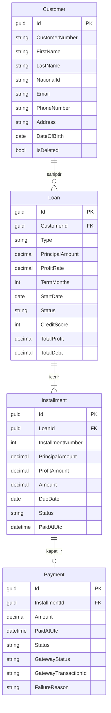
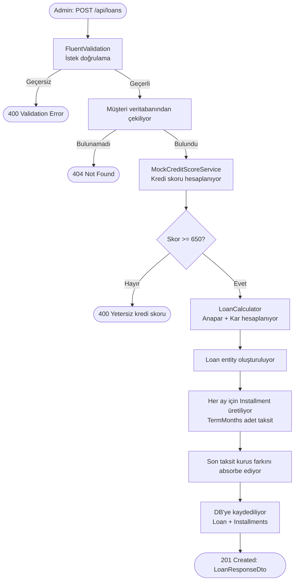

# Nomisma

## Teknik Gereksinimler

Nomisma, bireysel musterilerin kredi basvurularini, taksit planlarini ve geri odemelerini dijital ortamda yonetmek icin hazirlanan full-stack bankacilik case-study uygulamasidir.

- Backend: C# / .NET 8
- Frontend: React + TypeScript
- Database: Microsoft SQL Server
- Mimari: Clean Architecture
- Auth: JWT, `Admin` ve `Customer` rolleri

## Kurulum

Backend:

```bash
dotnet tool restore
dotnet restore
dotnet ef database update --project src/Nomisma.Infrastructure --startup-project src/Nomisma.Api
dotnet run --project src/Nomisma.Api
```

Frontend:

```bash
cd client
npm install
npm run dev
```

Varsayilan API adresi `http://localhost:5030`. Farkli bir port kullaniliyorsa client icin `VITE_API_URL` verilebilir.

```bash
VITE_API_URL=http://localhost:5030 npm run dev
```

## Local SQL Server

Varsayilan connection string:

```json
"Server=localhost;Database=NomismaDb;Trusted_Connection=True;MultipleActiveResultSets=true;TrustServerCertificate=True"
```

Local SQL Server instance farkliysa `src/Nomisma.Api/appsettings.Development.json` veya environment variable ile `ConnectionStrings__NomismaDb` degistirilebilir.

## Demo Hesaplari

- Admin: `admin@nomisma.local` / `Admin123!`
- Musteri: `customer@nomisma.local` / `Customer123!`

Development ortaminda uygulama acilirken migration uygulanir ve seed data olusturulur.

## Finansal Kurallar

Kredi hesaplama basit kar modeliyle yapilir:

```text
totalProfit = principal * profitRate / 100
totalDebt = principal + totalProfit
```

Toplam borc vade ay sayisina esit bolunur. Kurus yuvarlama farki son taksite yansitilir; bu sayede taksit toplamlari toplam borcla birebir eslesir.

Odeme kuralı: v1'de odeme tutari tam taksit tutariyla eslesmelidir.

Gerekce: Case-study v1 modeli her `Payment` kaydini tek bir `Installment` kaydina baglar. Kismi odeme veya fazla odeme desteklenirse kalan bakiye, mahsuplasma, iade ve muhasebe kurallari icin ayri domain modeli gerekir. Finansal tutarliligi sade ve denetlenebilir tutmak icin v1 kapsaminda yalnizca tam taksit kapama desteklenir.

## Mock Entegrasyonlar

Kredi skoru:

- `MockCreditScoreService` musteri bilgisine gore deterministik skor uretir.
- Skor `650` altindaysa kredi olusturma reddedilir.
- `risk` iceren email veya `0` ile biten kimlik numarasi dusuk skor dondurur.

Odeme gateway:

- `MockPaymentGateway` odeme kaydi olusmadan once cagrilir.
- `4111111111111111` gibi gecerli test kartlari basarili doner.
- `4000000000000002` ve `0000000000000000` reddedilir.
- Gateway basarisizsa `Payment` kaydi olusmaz ve taksit durumu degismez.

## ER Diyagramı



## API Endpoint Listesi

| Metot | Endpoint | Rol | Açıklama |
|-------|----------|-----|----------|
| POST | `/api/auth/login` | — | Kullanıcı girişi, JWT döner |
| GET | `/api/customers` | Admin | Tüm müşterileri listeler |
| GET | `/api/customers/{id}` | Admin | Müşteri detayı |
| GET | `/api/customers/{id}/summary` | Admin | Müşteri özeti (krediler + taksitler) |
| GET | `/api/customers/me/summary` | Customer | Giriş yapan müşterinin özeti |
| POST | `/api/customers` | Admin | Yeni müşteri oluşturur |
| PUT | `/api/customers/{id}` | Admin | Müşteri bilgilerini günceller |
| DELETE | `/api/customers/{id}` | Admin | Müşteriyi soft-delete ile siler |
| GET | `/api/loans` | Admin / Customer | Kredileri listeler (`?customerId=` ile filtreler) |
| GET | `/api/loans/{id}` | Admin / Customer | Kredi detayı |
| POST | `/api/loans` | Admin | Yeni kredi oluşturur, taksit planını üretir |
| PUT | `/api/loans/{id}` | Admin | Kredi durumunu günceller (Active / Closed) |
| GET | `/api/loans/{id}/installments` | Admin / Customer | Krediye ait taksit listesi |
| GET | `/api/installments/{id}` | Admin / Customer | Taksit detayı |
| PUT | `/api/installments/{id}` | Admin | Taksit bilgilerini günceller |
| GET | `/api/payments` | Admin / Customer | Ödeme listesi |
| GET | `/api/payments/{id}` | Admin / Customer | Ödeme detayı |
| POST | `/api/payments` | Admin / Customer | Taksit ödemesi yapar |

> Customer rolündeki kullanıcılar yalnızca kendi kayıtlarına erişebilir.

## Kredi Oluşturma ve Taksit Üretme Akışı



Taksit tutarı: `monthlyAmount = TotalDebt / TermMonths` (yuvarlama farkı son taksite eklenir).

## Dogrulama

```bash
dotnet test
cd client
npm run build
```

## Yapay Zeka Kullanımı

Bu projede geliştirme sürecinde yapay zeka araçlarından (Claude) yararlanılmıştır.

**Kullanılan alanlar:**

- Mimari iskelet — Clean Architecture katman yapısı ve proje dizin düzeni için fikir alınmıştır.
- Boilerplate üretimi — EF Core entity konfigürasyonları, DTO sınıfları ve FluentValidation kuralları için taslak oluşturulmuştur.
- Diyagram sözdizimi — Mermaid ER ve flowchart bloklarının sözdizimi için yardım alınmıştır.
- README taslağı — Bölüm başlıkları ve açıklama metinleri için ilk taslak üretilmiştir.

**Nasıl kullanıldı:**

AI tarafından üretilen çıktılar doğrudan kopyalanmamıştır. Her çıktı gözden geçirilmiş, projenin gerçek domain mantığına göre düzenlenmiş ve manuel olarak test edilmiştir. Finansal hesaplama modeli (`LoanCalculator`), kredi skoru eşiği, ödeme gateway akışı ve iş kuralları tarafımdan tasarlanmıştır.


